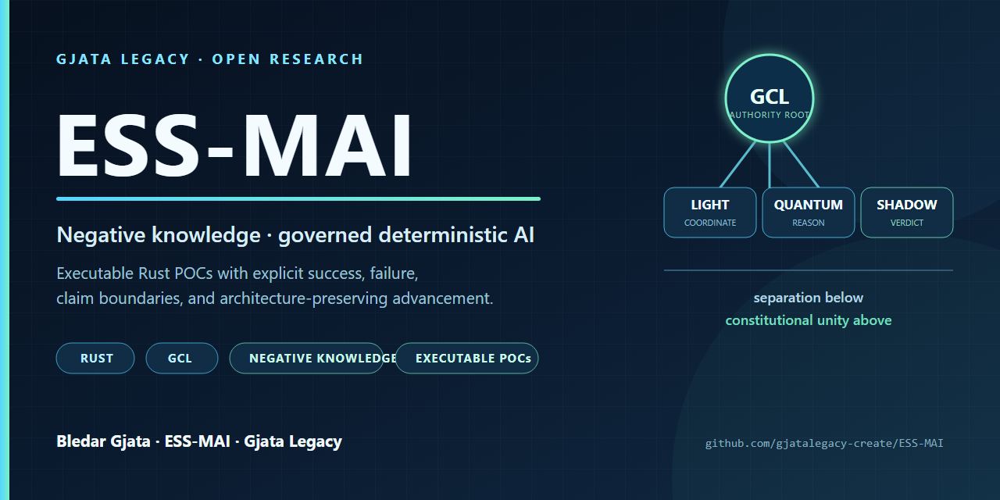

# ESS-MAI by Bledar Gjata · Gjata Legacy



[](https://github.com/gjatalegacy-create/ESS-MAI/actions/workflows/poc-validation.yml)
[](LICENSE)
[](https://doi.org/10.5281/zenodo.22074028)
[](https://archive.softwareheritage.org/swh:1:dir:79459e40e31b2a248c87402a1e20b99f067d66d3;origin=https://doi.org/10.5281/zenodo.22074027;visit=swh:1:snp:678c388d6e821b03c00cc276aa1366e2575c7191;anchor=swh:1:rel:f74b7c45dfbcd0046722ff7aadd4a7e238d569d6;path=/executable-prior-art/)

## Executable research in negative knowledge and governed deterministic AI

**ESS-MAI** is an experimental deep-tech research and systems-engineering project by **Bledar Gjata** at **Gjata Legacy**. It investigates a Rust-based architecture for bounded hierarchical authority, traceable reasoning, deterministic state transitions, fail-closed behavior, and the preservation of negative knowledge as operational evidence.

> **Evidence rule:** every public claim is bounded by disclosed source, an executable procedure, or an explicitly identified reference. A successful build proves compilation for the tested scope; it does not prove every architectural or scientific claim.

## Start here

| Resource | What it provides |
| --- | --- |
| [Executable prior-art collection](publications/executable-prior-art/) | Canonical Apache-2.0 index of the public ESS-MAI POCs |
| [POC 003 — cold-start reachability](publications/executable-prior-art/poc-003-system-cold-start-reachability/) | System POC reproducing the empty-state reachability gap and an exact-pair causal control |
| [POC 004 — GCL LAW-0 continuity](publications/executable-prior-art/poc-004-gcl-law0-global-continuity/) | Theory POC reproducing supported local behavior and counterexamples to stronger global continuity |
| [Machine-readable manifest](publications/executable-prior-art/manifest.json) | Sealed pre-tag state, validation results, disclosure boundaries, and artifact-manifest hashes |
| [Citation metadata](CITATION.cff) | Author, project, affiliation, license, and research keywords |
| [Zenodo software record](https://doi.org/10.5281/zenodo.22074028) | Version DOI for the exact v1.0.0 POC 003 + POC 004 deposit |
| [Software Heritage archive](https://archive.softwareheritage.org/swh:1:dir:79459e40e31b2a248c87402a1e20b99f067d66d3;origin=https://doi.org/10.5281/zenodo.22074027;visit=swh:1:snp:678c388d6e821b03c00cc276aa1366e2575c7191;anchor=swh:1:rel:f74b7c45dfbcd0046722ff7aadd4a7e238d569d6;path=/executable-prior-art/) | Content-addressed SWHID for the extracted executable-prior-art tree |

A separate private ESS-MAI v1.8.9 workspace is outside this disclosure. C01 and C02 are historical references only and are not evidence for these POCs.

## What the project investigates

- **Gjata Collapse Law (GCL):** the ESS-MAI-defined constitutional authority model that delegates and bounds subordinate system roles without collapsing them into peers.
- **Negative knowledge:** failures, exclusions, rejected paths, and non-materialized claims preserved as usable evidence rather than discarded.
- **Light–Quantum–Shadow separation:** named ESS-MAI roles for coordination, reasoning, and verdict/persistence under GCL; “Quantum” does not claim quantum hardware or quantum computation.
- **Traceable deterministic reasoning:** explicit transitions, evidence-bound handoffs, reproducible contracts, and fail-closed gates.
- **Executable prior art:** Rust/Cargo POCs that publish successful results and experimental failures together with the smallest architecture-preserving advancement method; the publication title is not a patent-office novelty determination.

## Public evidence snapshot

| POC | Class | Published maintainer-verified result |
| --- | --- | --- |
| POC 003 v0.2.0 | System POC | Cargo build PASS; 84/84 tests; empty cold-start gap reproduced 3/3; exact-pair control passed 1/1 |
| POC 004 v0.2.0 | Theory POC | Cargo build PASS; 19/19 tests; supported behavior and counterexamples reproduced 5/5 |

The tagged collection [manifest](https://github.com/gjatalegacy-create/ESS-MAI/blob/ess-mai-executable-prior-art-v1.0.0/publications/executable-prior-art/manifest.json) deliberately preserves its historical pre-tag release-candidate state and remains authoritative for disclosed artifact scope and hashes. Publication status is established by the immutable GitHub Release and Zenodo record. Run counts above come from the deposited maintainer evidence and are not presented as independent replication.

## Reproduce the public POCs

```bash
# POC 003
cd publications/executable-prior-art/poc-003-system-cold-start-reachability
cargo build --workspace --all-targets --locked
cargo test --workspace --all-targets --locked

# POC 004
cd ../poc-004-gcl-law0-global-continuity
cargo build --workspace --all-targets --locked
cargo test --workspace --all-targets --locked
```

For exact extraction checks, environment notes, and expected outputs, use each capsule's `REPRODUCIBILITY.md`. The public workflow reruns both Cargo suites on the default branch.

## Research participation

- [Submit an independent reproducibility report](https://github.com/gjatalegacy-create/ESS-MAI/issues/new?template=reproducibility-report.yml)
- [Open an evidence-bound research question](https://github.com/gjatalegacy-create/ESS-MAI/issues/new?template=research-question.yml)
- Read [CONTRIBUTING.md](CONTRIBUTING.md) before proposing changes to a sealed POC.
- See [SUPPORT.md](SUPPORT.md) and [CODE_OF_CONDUCT.md](CODE_OF_CONDUCT.md) for the public participation boundary.
- Use [SECURITY.md](SECURITY.md) for private reporting of security-sensitive findings.

## Canonical identity

- **Author / architect:** [Bledar Gjata](https://github.com/gjatalegacy-create)
- **Project:** ESS-MAI
- **Organization / affiliation:** Gjata Legacy
- **Public contact:** [gjata@legacy.al](mailto:gjata@legacy.al)
- **Core research concept:** Gjata Collapse Law (GCL)
- **Implementation:** Rust and Cargo
- **Status:** active experimental research prototype with partial materialization

## Public references

- [Zenodo — ESS-MAI Executable Prior Art v1.0.0](https://doi.org/10.5281/zenodo.22074028)
- [Software Heritage — content-addressed POC collection](https://archive.softwareheritage.org/swh:1:dir:79459e40e31b2a248c87402a1e20b99f067d66d3;origin=https://doi.org/10.5281/zenodo.22074027;visit=swh:1:snp:678c388d6e821b03c00cc276aa1366e2575c7191;anchor=swh:1:rel:f74b7c45dfbcd0046722ff7aadd4a7e238d569d6;path=/executable-prior-art/)
- [OpenAIRE — indexed ESS-MAI research software](https://explore.openaire.eu/search/result?pid=10.5281%2Fzenodo.22074028)
- [GitHub Release — POC 003 + POC 004 executable prior art](https://github.com/gjatalegacy-create/ESS-MAI/releases/tag/ess-mai-executable-prior-art-v1.0.0)
- [Business Magazine Albania — Bledar Gjata and ESS-MAI](https://businessmag.al/a-jemi-drejt-nje-ai-sovrane-bledar-gjata-dhe-vizioni-ambicioz-pas-ess-mai/)
- [ACP Albania — ESS-MAI, a project by Bledar Gjata](https://acp.al/posts/6645/ess-mai-projekti-i-bledar-gjates-qe-synon-nje-qasje-te-re-ndaj-inteligjences-artificiale/)
- [LinkedIn — Bledar Gjata](https://www.linkedin.com/in/bledar-gjata-1a527030b/) · [X — Gjata Legacy](https://x.com/Gjata_Legacy) · [YouTube — ESS-MAI](https://www.youtube.com/watch?v=i23jeqIwqJA)

## Technical documentation / Dokumentacioni teknik

Dokumentacioni teknik më poshtë ruan përshkrimin ekzistues të arkitekturës dhe materializimit të projektit.

## Arkitektura: Triniteti Light–Quantum–Shadow

```
INPUT → LIGHT (koordinim+trace, s'vendos)
      → QUANTUM (arsyetim+presion+eliminim, s'jep verdikt)
      → SHADOW (verdikt + persistencë brenda juridiksionit të deleguar nga GCL)
      → LIGHT → OUTPUT
```

## — Fortësim Sigurie (14 rregullime për sistem real)

| # | Dobësia | Rregullimi |
|---|---------|-----------|
| 1 | Wire format i brishtë (delimiterë në free-text) | **escape/unescape** për content/text (round-trip i provuar) |
| 2 | deserialize validon vetëm trace_id | **fail-closed**: të 7 fushat kritike të detyrueshme |
| 3 | from_payload pranon payload të paplotë | **fail-closed**: trace_id+verdict+seal+state+content |
| 4 | carries_seal me contains (substring) | **seal strukturor**: formula kanonike (flags & 0xFFFF)^0xA5A5==500 |
| 5 | seal = QNT:trace_id (jo provë) | **hash mbi content**: QNT:trace:sha256(envelope) |
| 6 | Contract pa integritet (fusha modifikohen) | **fingerprint** kanonik; enforce() rikomputon e krahason |
| 8 | Fallback no-op duket sukses | **fail-closed**: `--no-default-features` → BusUnavailable |
| 9 | SHA256 C placeholder (zero) | **Rust real i vetmi autoritet**; C hequr nga sha256_of |
| 10 | "zero-copy" pretendohet ku klonon | **dokumentim i ndershëm**: ligji vlen për rrugën kryesore (move) |
| 11 | sovereign_commit payload bosh → sukses | **error -5 EmptyPayload** (jo 0) |
| 12 | ChainRejected humb shkakun | **reason_code + failure_stage** (bit-i mbetet i thjeshtë) |
| 13 | Verdiktet kompresohen herët | diagnoza e plotë ruhet; 0/1 vetëm në dalje |
| 14 | FFI kthen sukses kur vault-i mungon | **error -6 VaultUnavailable**; zero nuk maskon shkrim të munguar |
| 15 | Backend refuzon shkrimin por FFI kthen 0 | **error -7 VaultWriteFailed**; lineage regjistrohet vetëm pas persistimit |

## Ndarja Prod vs Dev (#8)

```bash
# Testim/ndërtim i plotë — v1.6.0 kërkon binarin Shadow main.rs:
cargo build --workspace
cargo test --workspace --all-targets

# Runtime (PowerShell shembull):
# $env:ESSMAI_HANDOFF_DIR='C:\essmai\handoff'
# cargo run -p quantum-platform
# Quantum gjen shadow_platform.exe si sibling ose nga ESSMAI_SHADOW_BIN.

# PRODHIM (fail-closed — kërkon kernel/bus real):
cargo build --release -p light-platform --no-default-features --features c_kernel
```


## Complete mediation v1.5.9

Shadow është target **vetëm binar** (`autolib=false`). `lib.rs` përfshihet brenda
`shadow/src/main.rs`; Quantum varet vetëm nga `shadow_contracts` dhe komunikon
me procesin `shadow_platform`. Pa Shadow main aktiv nuk ka ingest, vault, token
ose `VerificationReceipt`; rrjedha ndalon fail-closed.


## Architectural closure v1.6.0

v1.6.0 ruan complete mediation të v1.5.9 dhe mbyll katër vazhdimësi të
provuara në kod:

1. GCL ekziston para aktivizimit të Spine 9 dhe i njëjti `process_digest`
   udhëton në Layer 1 → Layer 2 → Layer 3; Layers vetëm e thellojnë procesin.
   Çdo mode i PD aktivizon të gjithë maskën `111`.
2. PIM + NPIM + MPRO prodhojnë një paketë finale me provat PIM, argumentet
   NPIM, blob lineage dhe 16 matjet MPRO. Paketa bart edhe materialin e plotë
   të continuum/activation/Spine; Shadow main rillogarit `i+U→i₀→1Q`, GCL,
   aktivizimin, materialin kanonik të çdo Layer-i, të tre receipts dhe
   completion-in para core-it.
3. SHA-256 i inputit prodhohet në Light, verifikohet në Quantum dhe
   rillogaritet përsëri në Shadow.
4. PD Light është korrier iZ: Nura dhe UI-ja e vjetër emocionale marrin të
   njëjtin sinjal të verifikuar në paralel. UI-ja e vjetër e transmeton si
   `[PD_LIGHT/IZ]` në stdout-in e Light; Tauri e kthen në komandë për UI-në e re.

`light_spine` mbetet spine emocional/interpretues i Light-it dhe nuk është
PD Spine 9. Legacy Shadow C mbetet vëzhguesi i vazhdueshëm i afrimit drejt
Legacy; nuk zëvendësohet nga receipt-i final i Shadow main.

Verifikimi i plotë në Windows GNU:

```powershell
.\VALIDATE_V160.ps1
```

## Invariantet kushtetuese të synuara dhe të testueshme

1. **Zero if/else klasik** — match/boolean/formula (match-guards të lejuar).
2. **Quantum s'vendos kurrë** — prodhon provë për Shadow.
3. **GCL është autoriteti sovran kushtetues** — Shadow ushtron vetëm juridiksionin e deleguar të verdiktit/persistencës dhe nuk merr sovranitetin e parent-it.
4. **Asnjë klon i panevojshëm** — move në rrugën kryesore.
5. **Trace para çdo logjike**.
6. **Reasoning Purity** — vetëm Shadow shkruan persistent.

## Platformat

| Platformë | Rol | Cargo |
|-----------|-----|-------|
| `light/`   | Koordinim, trace, transport, UI, kontrata | `light-platform` |
| `quantum/` | Arsyetim, NPRO, HCP_PRO, MPRO, Digital Lab | `quantum-platform` |
| `shadow/`  | Verdikt dhe persistencë brenda autoritetit të deleguar nga GCL; ECO, NightWatch, VNK vault | `shadow_platform` |

---
**GJATA LEGACY™ — ESS-MAI** • Sovereign Deterministic Reasoning Substrate
